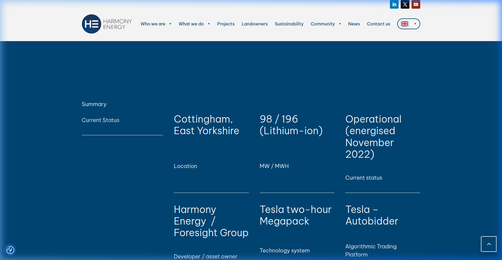

# P10 Verification Sources (UK-HARMONY-001)

Verifiable public anchors and snapshots establishing the admissibility of the data and claims:

*   **Pillswood BESS Claim Source:**
    *   *Live Link:* [Harmony Energy - Pillswood BESS](https://www.harmonyenergy.co.uk/pillswood-bess/)
    *   *Archive Snapshot:* [web.archive.org/web/20260707142812/https://www.harmonyenergy.co.uk/pillswood/](https://web.archive.org/web/20260707142812/https://www.harmonyenergy.co.uk/pillswood/)
    *   *Local Evidence Snapshot:*
        
*   **Elexon Insights Portal (BMRS Telemetry Source):**
    *   *Live Link:* [Elexon Insights Portal](https://insights.elexon.co.uk/)
    *   *Archive Snapshot:* [web.archive.org/web/20260707142510/https://insights.elexon.co.uk/](https://web.archive.org/web/20260707142510/https://insights.elexon.co.uk/)
*   **Data License Terms:**
    *   *Source:* Elexon BMRS Data Licence
    *   *Verbatim License text:*
        > *"Elexon Limited hereby grants You a worldwide, royalty-free, perpetual, non-exclusive licence to Use the BMRS Data subject to the conditions below. ... You are free to: copy, publish, distribute and transmit the BMRS Data; adapt the BMRS Data; exploit the BMRS Data commercially and non-commercially..."*
    *   *Attribution Requirement:*
        > *"Contains BMRS data © Elexon Limited copyright and database right 2026"*
