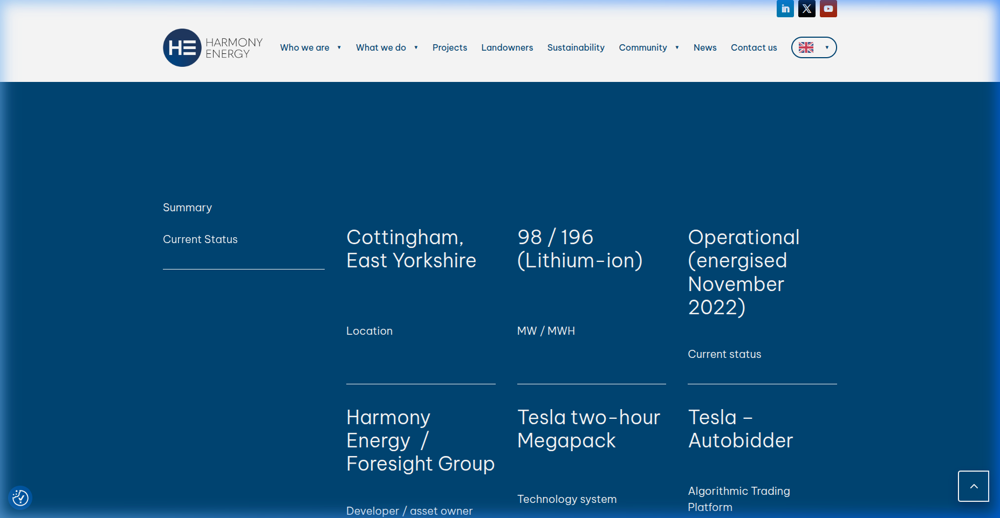

# P10 Verification Sources (UK-HARMONY-001)

Verifiable public anchors and snapshots establishing the admissibility of the data and claims:

*   **Pillswood BESS Claim Source:**
    *   *Claimant:* Harmony Energy
    *   *Asset Energisation Date:* November 2022 (stated on case study page as "energised November 2022")
    *   *Canonical Primary Claim URL (Active, HTTP 200 OK as of 2026-08-14):* [https://harmonyenergy.co.uk/case-studies/pillswood-bess/](https://harmonyenergy.co.uk/case-studies/pillswood-bess/)
    *   *Pre-Registered Wayback Archive Snapshot (Frozen Pre-Registration Anchor, HTTP 200 OK):* [web.archive.org/web/20260707134620/https://harmonyenergy.co.uk/case-studies/pillswood-bess/](https://web.archive.org/web/20260707134620/https://harmonyenergy.co.uk/case-studies/pillswood-bess/)
    *   *Archive Snapshot Timestamp:* `20260707134620` (verified opened HTTP 200 OK containing "98 / 196 (Lithium-ion)" MW / MWH claim)
    *   *Local Evidence Snapshot:*
        
*   **Elexon BMRS Portal (Telemetry Source):**
    *   *Active Portal Link (HTTP 200 OK):* [Elexon BMRS Portal](https://bmrs.elexon.co.uk/)
*   **Data License Terms:**
    *   *Source:* Elexon BMRS Public Data Licence
    *   *Verbatim Official License Template Text:*
        > "Elexon Limited hereby grants You a worldwide, royalty-free, perpetual, non-exclusive licence to Use the BMRS Data subject to the conditions below. You are free to: copy, publish, distribute and transmit the BMRS Data; adapt the BMRS Data; exploit the BMRS Data commercially and non-commercially for example, by combining it with other information, or by including it in your own product or application. Conditions: You must: acknowledge the source of the BMRS Data by including the following attribution statement and any safety information: 'Contains BMRS data © Elexon Limited copyright and database right [year]'; ensure that you do not use the BMRS Data in a way that suggests any official status or that Elexon endorses you or your use of the BMRS Data; ensure that you do not mislead others or misrepresent the BMRS Data or its source; ensure that your use of the BMRS Data does not breach the Data Protection Act 2018 or the Privacy and Electronic Communications (EC Directive) Regulations 2003."
    *   *Applied Attribution Obligation for Audit Window (2025–2026):*
        > "Contains BMRS data © Elexon Limited copyright and database right 2025–2026"
